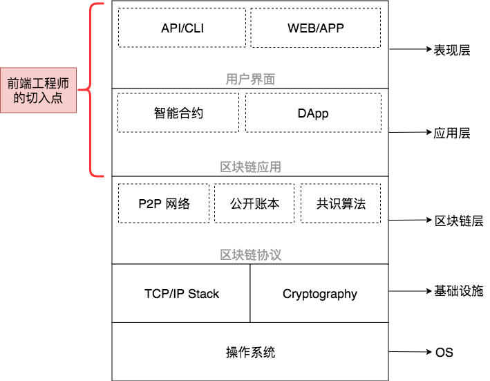
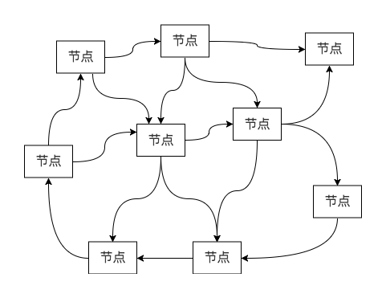
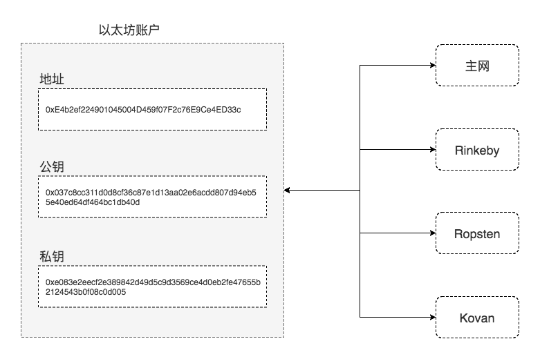
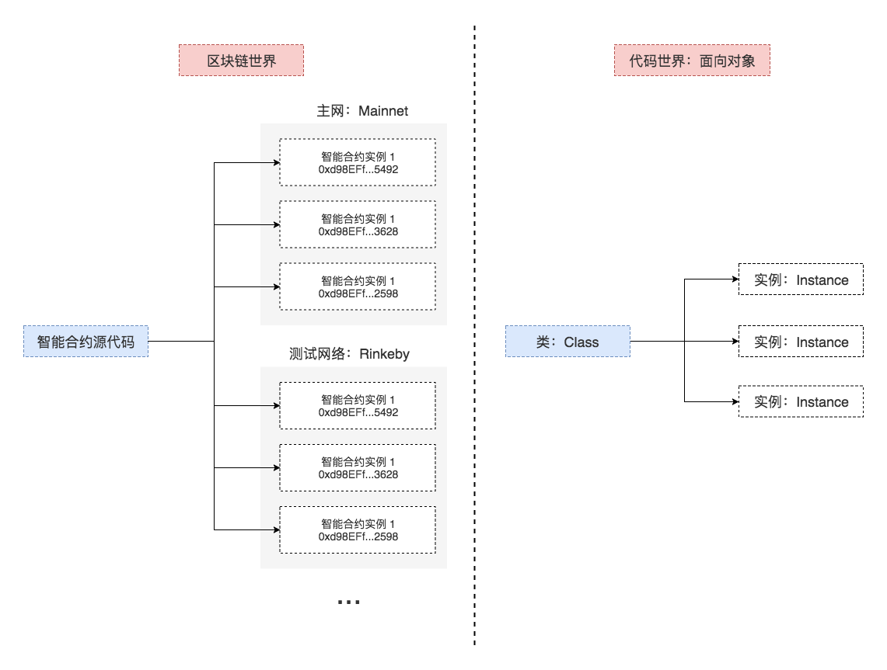
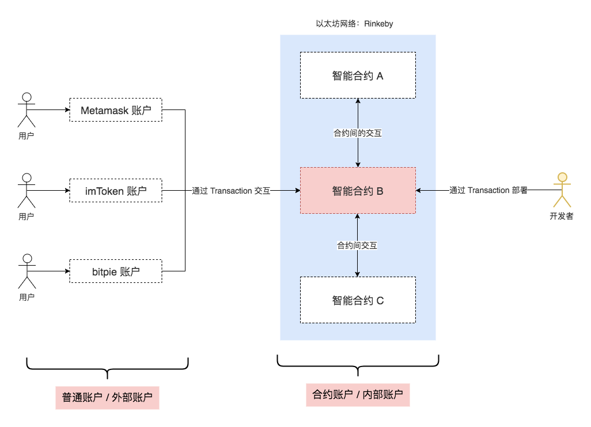
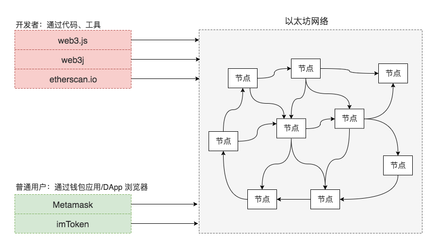

@title[以太坊智能合约和DApp从入门到上线]

# 以太坊智能合约DApp从入门到上线

---
@title[BigPicture]

---
@title[Agenda]

- 最少必要基础知识
- 开发环境准备 |
- 基于 Remix 的智能合约工作流 |
- 基于 Node.js 的智能合约工作流 |
- DApp 开发基本套路 |

---
@title[最少必要基础知识]

## 最少必要基础知识

+++
@title[区块链核心概念]

+++
@title[以太坊网络]

+++
@title[以太坊账户]

+++
@title[智能合约实例]

+++
@title[智能合约账户]

+++
@title[如何与以太坊网络交互]

---
@title[开发环境准备]

## 开发环境准备

+++
@[Metamask]

- 安装 Metamask
- 创建 Metamask 钱包和账户：HDWallet

+++
@[Faucet]

- 给测试钱包和账户充值
- 使用 etherscan 查看交易

---
@title[基于 Remix 的智能合约工作流]

## 基于 Remix 的智能合约工作流

- 输入代码
- 编译
- 部署 or 加载
- 调用合约方法

---
@title[基于 Node.js 的智能合约工作流]

## 基于 Node.js 的智能合约工作流

目标...

+++
@title[合约源代码]

TODO：合约源代码

+++
@title[合约编译]

> 使用 solc 作为基础工具

+++?code=scripts/compile.js&lang=javascript&title=Source: 编译脚本

@[1](todo)
@[11-12](todo)
@[14-17](todo)
@[20-22](todo)
@[25-30](todo)

+++
@title[合约部署]

> 先解决本地节点的问题，使用 truffle-hdwallet-provider 直接部署到 Rinkeby 测试网

+++?code=scripts/deploy.js&lang=javascript&title=Source: 部署脚本

+++
@title[自动化测试]

> 使用 ganache-cli 作为本地测试网络提供方，提高测试运行速度

+++?code=tests/Car.spec.js&lang=javascript&title=Source: 测试用例

---
@title[DApp架构]

DApp 的架构

---
@title[DApp部署]

DApp 的部署
